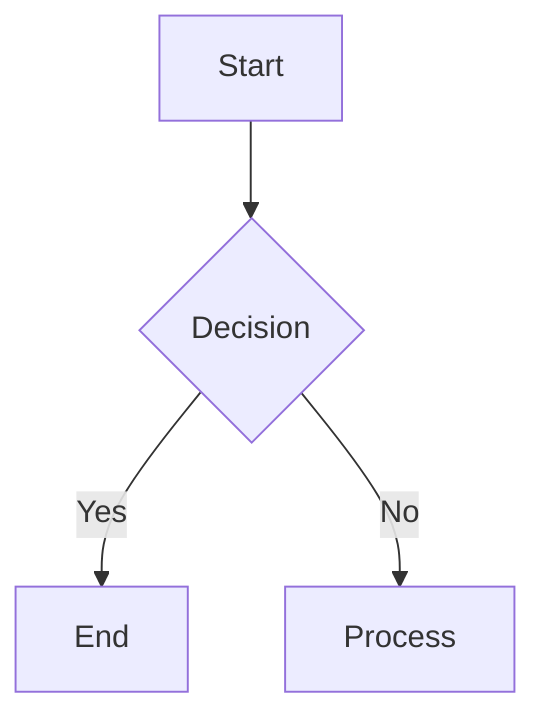

The Cursor IDE doesn't have mermaid chart support out of the box, but I found [this vs code extension](https://marketplace.cursorapi.com/items?itemName=bierner.markdown-mermaid) that turns this block of mermaid code

```
flowchart TD
    A[Start] --> B{Decision}
    B -->|Yes| C[End]
    B -->|No| D[Process]
```
into this


---------

I have a very large Supermemo knowledge base that I want to incorporate into this digital garden.


 I've been using Supermemo for years as my second brain and knowledge base / knowledge management system, but the inability to use it across devices _seamlessly_ leaves  