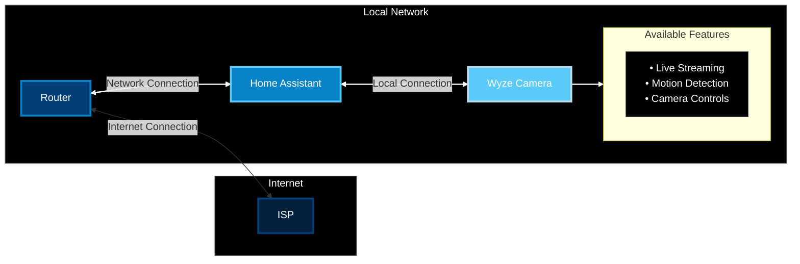

---
{"dg-publish":true,"permalink":"/site/using-home-assistant-to-replace-wyze/"}
---

I think it would be a worthwhile effort to protect my privacy by using home assistant or some other vendor-agnostic ecosystem, and storing footage locally as opposed to sending it to a company's cloud server. After all, if I don't own the infrastructure, I have no control if they get hacked or a leak occurs. 

Also, I'd rather pay the upfront cost of the hardware rather than pay a continuous subscription.

1. **Physical Control**
    - footage stays on-prem
    - No risk of cloud breaches
    - Full control of data
    - No unexpected data sharing (not to be confused with getting hacked)
2. **Access Control**
    - Only I can access recordings
    - No corporate employees can view footage
    - Complete control over who sees what
3. **Long-term Protection**
    - No subscription dependencies
    - Don't have to worry about TOS shenanigans
    - No risk of service shutdowns
    - privacy settings won't change unexpectedly

